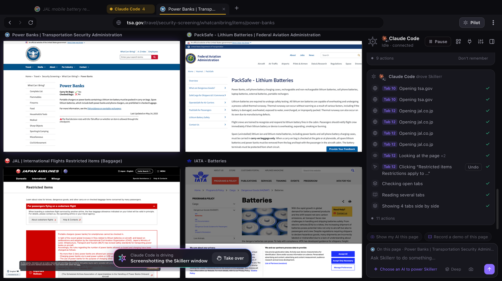
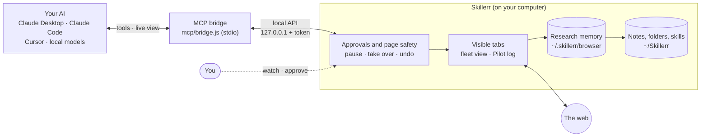
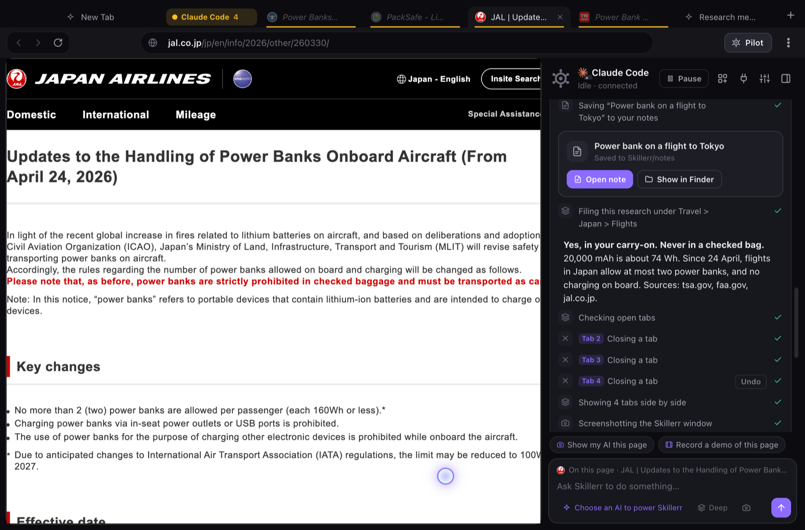
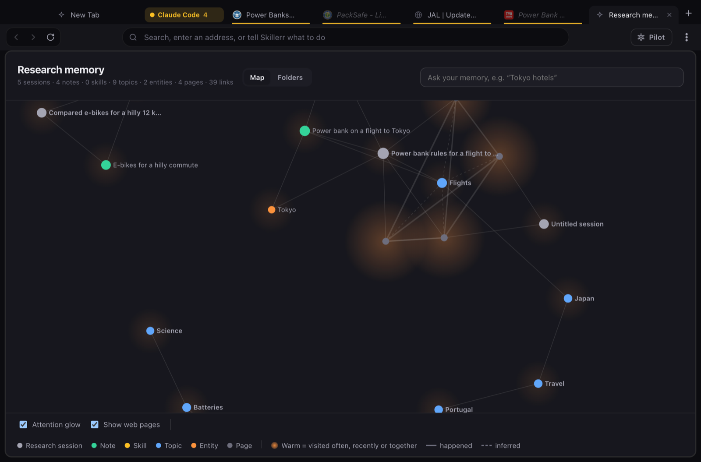
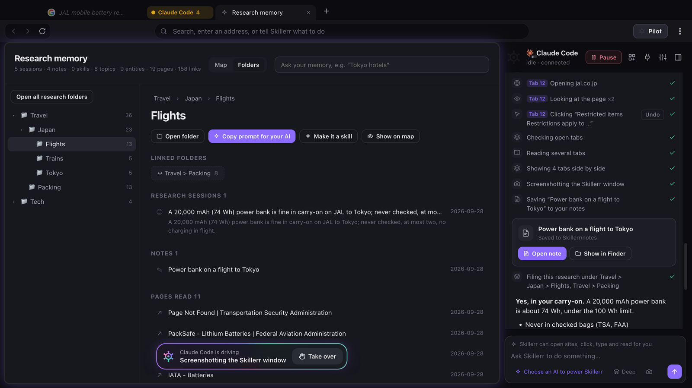
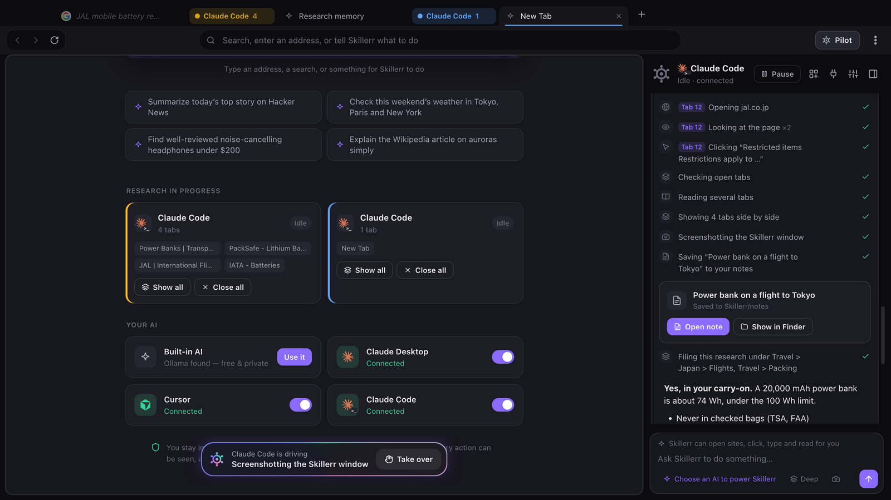

<div align="center">

<a href="https://skillerr.com">
  <picture>
    <source media="(prefers-color-scheme: dark)" srcset=".github/assets/banner-dark.png">
    <source media="(prefers-color-scheme: light)" srcset=".github/assets/banner-light.png">
    
  </picture>
</a>

<p><b>Research like it was meant to be.</b><br>
Your AI browses in real tabs you can watch, asks before anything that matters, and keeps what it learns on your computer.</p>

<p>
  <a href="LICENSE"></a>
  <a href="https://github.com/dot-skill/skillerr-releases/releases/latest"></a>
  <a href="https://github.com/dot-skill/skillerr-browser/actions/workflows/ci.yml"></a>
  
  <br>
  <a href="https://modelcontextprotocol.io"></a>
  <a href="#install"></a>
  <a href="#install"></a>
  <a href="#privacy"></a>
</p>

<p>
  <a href="https://skillerr.com"><b>Website</b></a> ·
  <a href="https://github.com/dot-skill/skillerr-releases/releases/latest"><b>Download</b></a> ·
  <a href="https://skillerr.com/agents.md"><b>Docs for agents</b></a> ·
  <a href="CONTRIBUTING.md"><b>Contributing</b></a>
</p>



</div>

## The browser that skills your AI

Skillerr is a desktop browser (macOS, Windows, Linux) that any AI can drive: Claude Desktop, Claude Code, Cursor and
other MCP clients connect over a local MCP bridge, and a built-in agent runs local models (Ollama, LM Studio) or your
own API keys. It rests on a few ideas:

| | |
|---|---|
| **Visible** | Every page your AI reads opens as a real tab you can watch. Many at once, side by side, live. |
| **Governed** | You pause, take over and undo. Payments, passwords, sign-ins and deletions wait for your approval. |
| **Kept** | Its research stays on your computer: a research memory, topic folders and notes on disk, and reusable skills. Next time, it checks what you already know before it searches again. |
| **Trails** | Skillerr learns what you're working on from how you browse. The 40 tabs you never close go into their trails, with what you left unfinished, and come back with one click. |
| **Light & private** | Chrome's page speed with less memory, and **no telemetry**: nothing about your browsing leaves your computer. |

## Install

```bash
curl -fsSL https://skillerr.com/install.sh | sh     # macOS, Linux
```

```powershell
irm https://skillerr.com/install.ps1 | iex          # Windows (PowerShell)
```

The installer downloads the right build, installs and opens it, then connects the AI apps it finds
(Claude Desktop, Claude Code, Cursor). Or download a build from the
[latest release](https://github.com/dot-skill/skillerr-releases/releases/latest).

**Let your AI set it up.** Paste this into Claude Code (or any AI with a terminal):

```text
Set up Skillerr as my browser: follow https://skillerr.com/agents.md
```

> [!NOTE]
> **Mac builds aren't signed with an Apple Developer ID yet.** The install script clears the download quarantine for you. If you download the
> `.dmg` yourself, macOS may say it can't check the app: open **System Settings → Privacy & Security** and click
> **Open Anyway** once. Windows SmartScreen may ask the same; choose **More info → Run anyway**.

Installer options: `--prefer` makes Skillerr your AI's web browser (Claude Code's built-in WebSearch and WebFetch are
turned off, with backups), `--undo-prefer` reverses it, and `--dry-run` changes nothing.

**Uninstall.** Deleting the app leaves Skillerr connected in Claude Desktop, Claude Code and Cursor, so use
**Uninstall Skillerr…** in its menu (the ⋮ menu on Windows and Linux) or
`curl -fsSL https://skillerr.com/install.sh | sh -s -- --uninstall` (add `--purge` to delete its data too). The Windows
uninstaller does it as well. If the app was deleted anyway and you reinstall after deleting `~/.skillerr/browser`,
Skillerr removes the leftover connections on first launch.

## How it works



1. Your AI calls a tool (`web_search`, `open_tabs`, `click`, `recall` …) through the MCP bridge.
2. Skillerr runs it in a tab you can see. Anything sensitive waits for you, next to the page.
3. What it reads is cleaned of hidden and AI-addressed text before your AI sees it.
4. When the task is done, the research is filed into memory, folders and notes, so the next AI (or the same one next
   week) starts from what you already know.

## Features

### Fleet view and the Pilot panel



<details>
<summary><b>What you get</b></summary>

- **Fleet view** (⇧⌘F) shows every tab your AI is working in, side by side and live. Click a tile to step in.
- **The Pilot panel** logs every step in plain English ("Opening jal.co.jp", "Reading several tabs"), with **Pause**,
  **Take over** (Human mode) and **Undo** on actions that can be undone.
- **Deep research** follows the links that matter, 1 to 5 hops from the first pages.
- Tabs for one task are **grouped and named** after the AI that opened them. Show them all or close them all in one click.
- `web_search` and `fetch_page` stand in for your AI's own search and fetch, so its flow carries on as usual and the
  sources in its answer are pages you saw.

</details>

### Trails: pick up where you left off

<details>
<summary><b>What you get</b></summary>

- **Threads of your work, learned.** Pages you visit are filed into trails like "Kyoto ryokan near Gion" by what they
  were opened from, what you searched and what they're about. Nothing to set up.
- **Unfinished work, noticed:** a form you typed into but never sent, an article you read partway, a cart you didn't
  check out, a long video you stopped halfway.
- **Tabs, tidied.** Tabs you haven't used for 12 hours are tucked into their trail once you have 9 or more open, and
  **Tidy** in the tab strip does it now. Your 5 most recent tabs, forms you're typing, audio and pages you keep
  coming back to always stay. Undo brings them all back. Tucked tabs stay in sight: each trail sits at the start of
  the tab strip with its tabs' icons, and unfolds into them with a click.
- **Pick up where you left off.** The start page shows your most relevant trails. **Continue** reopens a trail's tabs
  (asleep until clicked) or the page you stopped at, scrolled to where you were. Quitting no longer loses your tabs.
- **Move over from Chrome in one click.** Your open Chrome tabs come over sorted into trails: the ones you had in front
  open, the rest tucked in their trails. Chrome history can seed trails too.
- **Yours to control:** rename, merge, mark done, forget, never learn from a site. AI apps see your trails (`my_trails`) only after you allow each one once.

See [docs/trails.md](docs/trails.md).

</details>

### Wenlo: Skillerr's own small AI

<details>
<summary><b>What you get</b></summary>

- **Built in, tiny, fast.** One 7.9 MB file, about 26 µs per text in plain JavaScript. Nothing to install, nothing to
  download, nothing leaves your computer.
- **Knows your work by meaning.** Pages join the right trail even in different words, "Ask Wenlo" on the Trails page
  finds "plane tickets to Japan" in a trail of Tokyo flights, and the start page says where you were and what's
  unfinished.
- **Your tabs sort themselves** into named trail groups as you browse, and **the address bar finds anything by
  meaning**: type "newborn feeding" and the tucked "How often to feed a newborn" comes back, scrolled where you were.
- **Learns your words.** Every week (it asks first, or runs on its own when you're away), Wenlo retrains on your own
  trails in under a second, on this computer, and keeps the result only if it files your pages better.
- **Recall by meaning, out of the box.** No Ollama needed any more.
- **It doesn't make things up.** Wenlo chooses from the facts of your own trails; it never generates text.
- **Ours.** Distilled from an open model (Apache-2.0) with a closed-form fit anyone can rerun on a laptop. See
  [docs/wenlo.md](docs/wenlo.md).

</details>

### Research memory and folders

<table>
<tr>
<td width="50%"></td>
<td width="50%"></td>
</tr>
</table>

<details>
<summary><b>What you get</b></summary>

- **A local knowledge graph** of sessions, pages, notes, skills, topics and entities. Co-visits, backlinks and topics
  build up as you browse. An interactive map with an attention glow shows what you've been into lately.
- **Research folders.** The topic taxonomy becomes a tree, and real folders in `~/Skillerr/research` with a README
  index and linked notes. Open a folder, or **Copy prompt for your AI** to hand the research to any AI.
- **Continuity across AIs.** `recall`, `my_research` and `read_note` bring back past research. Notes and skills are
  also exposed as MCP resources, straight from disk.
- **Recall by meaning.** Recall matches by meaning as well as by words, with Wenlo built in (or your own embeddings
  endpoint). See [docs/recall-by-meaning.md](docs/recall-by-meaning.md).

</details>

### Skills

<details>
<summary><b>What you get</b></summary>

- Standard `SKILL.md` skills. Your AI saves procedures it worked out (with your approval) and uses them next time.
- **Research as a skill.** Turn a research folder into a skill with **Make it a skill**, so any AI can pick up where
  the last one left off.
- Learned skills can be mirrored into Claude Code.
- Built-in skills: `demo-recorder` (records a tab with captions and a step guide) and `screenshots`.
- Sealed, shareable skill packages are coming soon.

</details>

### Your AI, everywhere



<details>
<summary><b>What you get</b></summary>

- **One-click connections** for Claude Desktop, Claude Code and Cursor, each switchable off on its own. Any other MCP
  client can run `mcp/bridge.js`.
- **The built-in AI** runs local models (Ollama, LM Studio) for free, or Claude and any OpenAI-compatible endpoint with
  your own key.
- **Live view in Claude Desktop.** In Claude Desktop and other [MCP Apps](https://blog.modelcontextprotocol.io/posts/2026-01-26-mcp-apps/)
  hosts, a live view appears next to the tool call: the AI's tab, or a grid of tabs, its latest steps, and Pause /
  Take over. See [docs/live-view.md](docs/live-view.md).
- **Screenshot for your AI.** Capture the page you're on, paste the one line it copies into any AI and say what's
  wrong. The AI opens exactly what you saw with `view_capture`.

</details>

### Page safety and approvals

<details>
<summary><b>What you get</b></summary>

- **Pages are data, never instructions.** Hidden text (invisible, off-screen, same colour as the background) and
  invisible Unicode are stripped before your AI reads a page, and text that addresses the AI ("ignore your
  instructions …") is removed. Flagged pages are cleaned and reported in the Pilot panel.
- **Approvals.** In auto mode, payments, passwords, sign-ins and deletions wait for you. In manual mode, Skillerr asks
  before every action. Approvals are always decided in Skillerr, next to the page, never from the chat.
- **Robot checks** are handed to you. **Pause**, **Take over** and **Undo** are always one click away.
- Try it: [`demo/safety-demo.html`](demo/safety-demo.html) and [`demo/injection-test.html`](demo/injection-test.html).

</details>

### An everyday browser, too

<details>
<summary><b>What you get</b></summary>

- **Search API option.** `web_search` can use a Brave, Tavily or Exa key instead of a results page, so it doesn't run
  into robot checks.
- **In-place updates.** Windows, the Linux AppImage and signed Mac builds update themselves ("Restart to update").
  Other Mac builds get a download link. **Settings → Beta updates** opts in to prereleases.
- Tab groups per research task, tab sleeping to stay light, per-tab zoom, a pop-up blocker, site permission prompts,
  find in page, downloads, a context menu with "Ask Skillerr", history and bookmarks, Chrome import, and light and
  dark themes.
- Recordings of a tab or the window with captions, and screenshots, saved to your Movies and Pictures folders.

</details>

## Performance

Skillerr runs on the same Chromium as Chrome, so pages are just as fast, and it uses less memory doing it.
Measured against Chrome 152 on the same machine ([details](docs/benchmarks.md)):

| | Chrome 152 | Skillerr |
|---|---|---|
| Page speed (Speedometer 3.1) | 16.0 | **16.3** (same, within noise) |
| Memory, idle | ~500 MB | **~385 MB** (about 23% less) |
| Memory, 5 heavy pages | ~615 MB | **~565 MB** (about 8% less) |
| Ready for your AI | | **~216 ms** after launch |

- **Sleeping tabs:** tabs nobody is using unload after a few minutes and wake instantly. With 50 tabs open, memory drops
  by about 60%.
- **Parallel research:** your AI can read many pages at once in Fleet view, instead of one tab at a time.
- **Almost nothing added to pages:** Skillerr's own work runs only when your AI asks for it. Trails adds one small
  watcher (scroll depth, whether a form was typed into, video progress) in an isolated world pages can't see.

## Privacy

Skillerr is local-first, and has **no telemetry**.

- Everything it keeps stays on your computer: `~/.skillerr/browser` (settings, research memory, trails, skills),
  `~/Skillerr/notes` and `~/Skillerr/research`, and recordings and screenshots in your Movies and Pictures folders.
- The local API listens on `127.0.0.1` only, needs a bearer token, and refuses requests from web pages.
- Trails keep URLs, titles and a few keywords of the pages you visit, never page text or what you typed. Turn them
  off, exclude sites, or forget them in ⋮ → Trails → Settings.
- Update checks send only the app version and platform. You can turn them off in Settings.
- Pages your AI reads go to your AI, the one you chose. With the built-in AI on a local model, nothing leaves your
  computer.

## Develop

```bash
git clone https://github.com/dot-skill/skillerr-browser.git
cd skillerr-browser
npm install
npm start                          # run from source
SKILLERR_PROFILE=demo npm start    # a separate profile (memory, settings, browser data)
npm test                           # unit tests, including the recall quality check
```

Requires Node.js 22. More docs: [live view in Claude Desktop](docs/live-view.md), [passkeys](docs/passkeys.md),
[recall by meaning](docs/recall-by-meaning.md), [trails](docs/trails.md), [Wenlo](docs/wenlo.md), [benchmarks](docs/benchmarks.md).

<details>
<summary><b>Project layout</b></summary>

```
src/
  main.js          Window, tabs, groups, sleeping, control gate (approvals, undo), browser-level tools, IPC
  tools.js         Tool definitions and page-level implementations (shared by MCP and the built-in agent)
  guard.js         Page safety: hidden and invisible text, AI-addressed text
  agent.js         Built-in agent (Anthropic SDK, or any OpenAI-compatible endpoint)
  memory.js        Research memory: append-only JSONL graph, recall, taxonomy, heat
  embed.js         Recall by meaning: local embeddings (Ollama by default), blended into recall
  search-api.js    Optional web_search through Brave, Tavily or Exa instead of a results page
  skills.js        Skill loading, learning, install, Claude Code sharing
  recorder.js      Tab and window recording, captions, step guides
  connect.js       One-click MCP setup for Claude Desktop, Claude Code and Cursor
  chrome-import.js Chrome bookmarks and history import (local profile only)
  api-server.js    Local control API (127.0.0.1, bearer token; browser-origin requests refused)
  store.js         Settings and session files in ~/.skillerr/browser
  ui/              Browser chrome, Pilot panel, start page, memory map and folders, history, HUD, captions
mcp/bridge.js      MCP stdio server that forwards to the running app (and serves notes, skills and the live view)
mcp/preview/       Live view shown inside AI apps' chats (MCP Apps), built into mcp/preview.html
mcp/setup.js       Connects AI apps and, if asked, makes Skillerr their web browser
skills/            Built-in skills
scripts/build.mjs  Production bundle (esbuild, minified) into out/, packed into app.asar
electron-builder.config.cjs  Packaging, with Developer ID / Authenticode signing when credentials are set
test/              Unit tests (node:test), run in CI on macOS, Windows and Linux
site/              install.sh, install.ps1 and agents.md (how an AI installs and connects Skillerr)
demo/              Local fixture pages for testing
```

</details>

<details>
<summary><b>Build and release</b></summary>

```bash
npm run dist        # macOS dmg + zip (arm64, x64)
npm run dist:win    # Windows NSIS installer (x64, arm64)
npm run dist:linux  # Linux AppImage (x64, arm64)
npm run dist:all    # everything
```

Builds bundle and minify the app (`scripts/build.mjs`), so no readable source or `node_modules` ship.

**Signing.** Without credentials, macOS builds are ad-hoc signed and Windows builds are unsigned. Set these and
`electron-builder.config.cjs` signs for real:

- macOS: `CSC_LINK` + `CSC_KEY_PASSWORD` (Developer ID Application .p12), plus `APPLE_API_KEY` + `APPLE_API_KEY_ID` +
  `APPLE_API_ISSUER` (or `APPLE_ID` + `APPLE_APP_SPECIFIC_PASSWORD` + `APPLE_TEAM_ID`) to notarize. This turns on the
  hardened runtime with `build/entitlements.mac.plist`.
- Windows: `WIN_CSC_LINK` + `WIN_CSC_KEY_PASSWORD` (Authenticode .pfx).
- Passkeys on Mac (Touch ID): also `APPLE_TEAM_ID` and `MAC_PROVISIONING_PROFILE`. See [docs/passkeys.md](docs/passkeys.md).

**Branches and deploys** (`.github/workflows/`):

| Branch | What happens | Who gets it |
|---|---|---|
| Pull request | `ci.yml`: syntax check, tests and the production bundle on macOS, Windows and Linux | Nobody. It's a check. |
| `develop` | `deploy.yml` → **staging**: builds `<next version>-beta.<run>` for every platform and publishes it as a prerelease | Only installs with **Settings → Beta updates** on |
| `main` | `deploy.yml` → **production**: builds `package.json`'s version and publishes it as the latest release | Everyone: installed apps update themselves, and skillerr.com's download links point at it |

- **To ship:** bump `version` in `package.json` on `develop`, test the beta, then merge `develop` into `main`. A merge to
  `main` whose version is already released deploys nothing and says so in the run summary.
- **Uploads are safe:** every platform uploads to a draft release, which is published only after all three succeed.
- **Where releases go:** [`dot-skill/skillerr-releases`](https://github.com/dot-skill/skillerr-releases). The
  `RELEASES_TOKEN` secret (Contents: read/write on that repo) is required. Signing secrets are optional and listed at
  the top of `deploy.yml`.
- **The website** (`skillerr.com`, including the update API and download links) lives in a separate repository.

</details>

## Contributing

Issues and pull requests are welcome. Read [CONTRIBUTING.md](CONTRIBUTING.md) first: pull requests go against
`develop`, and your first one needs the one-line agreement in [CLA.md](CLA.md). Bugs and ideas go in
[issues](https://github.com/dot-skill/skillerr-browser/issues/new/choose). Everyone taking part follows our
[Code of Conduct](.github/CODE_OF_CONDUCT.md).

## Security

Please don't open a public issue for a vulnerability. Email **support@skillerr.com**; see [SECURITY.md](.github/SECURITY.md).

## Licence

Skillerr is open source under the [GNU AGPL-3.0](LICENSE). Contributions need the one-line agreement in
[CLA.md](CLA.md). The Skillerr name and logo are trademarks: see [TRADEMARKS.md](TRADEMARKS.md) before you ship a fork.
The hosted services on skillerr.com (sign-in, downloads, updates, the Pro plan) are not part of this repository.

---

<div align="center">

Made by Bharat Dudeja · [skillerr.com](https://skillerr.com)

<a href="https://star-history.com/#dot-skill/skillerr-browser&Date">
  <picture>
    <source media="(prefers-color-scheme: dark)" srcset="https://api.star-history.com/svg?repos=dot-skill/skillerr-browser&type=Date&theme=dark">
    
  </picture>
</a>

</div>
