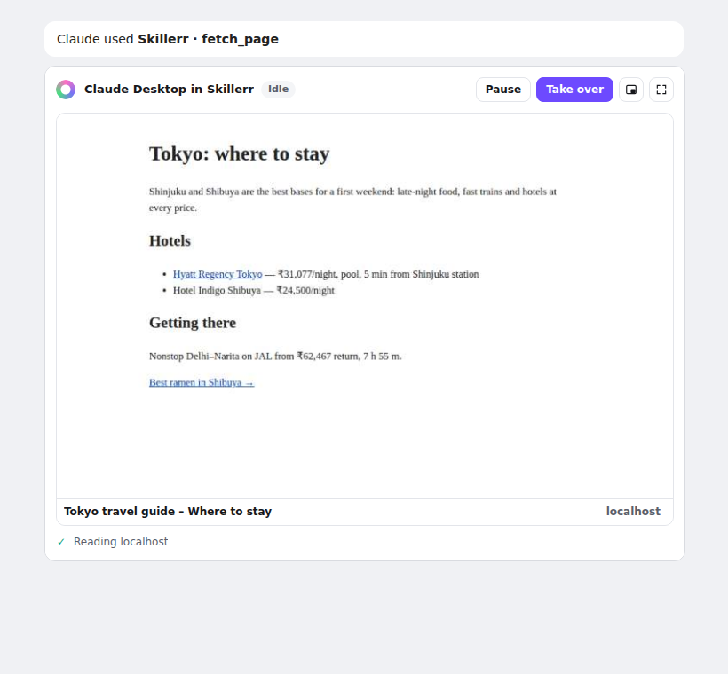
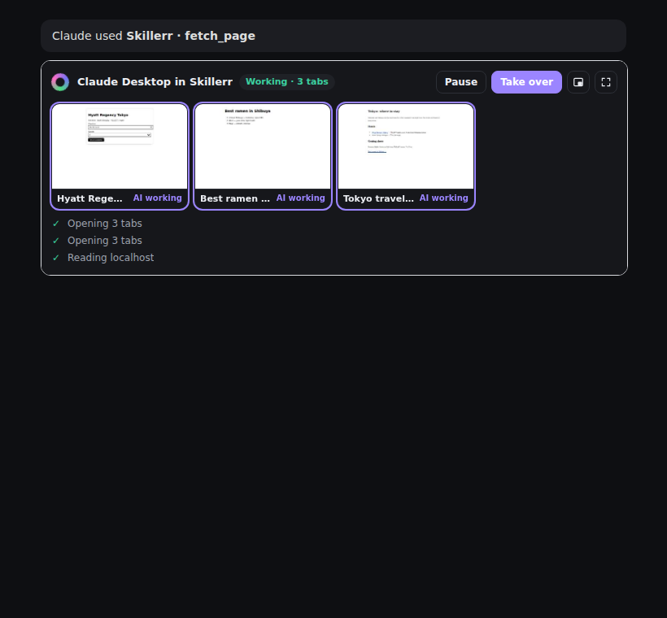
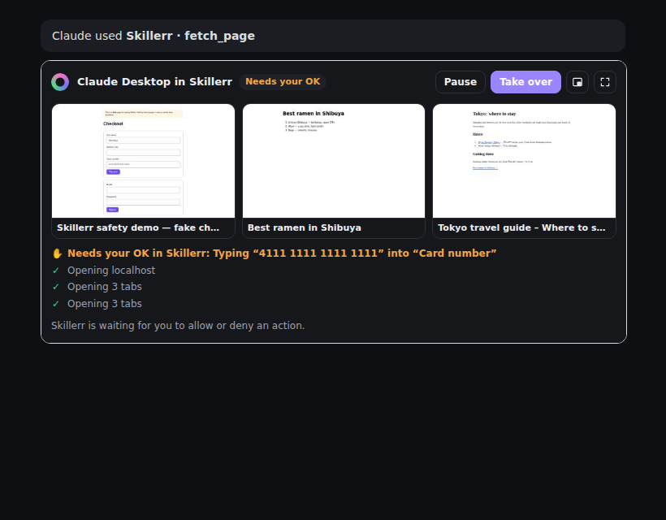

# Live view in Claude Desktop

When an AI app that supports [MCP Apps](https://blog.modelcontextprotocol.io/posts/2026-01-26-mcp-apps/) (Claude
Desktop, claude.ai, VS Code Copilot, Goose and others) uses Skillerr, a live view appears in the chat next to the tool
call. It shows what the AI is doing in Skillerr right now, updated about once a second:

| One tab | Several tabs (fleet) | Waiting for the user |
|---|---|---|
|  |  |  |

- **One tab:** a live thumbnail of the page the AI is on, with its title and site.
- **Fleet:** when the AI opens a burst of pages (`open_tabs`, `dispatch`, `deep_research`, fleet view in Skillerr), or
  works in several tabs within the last 30 seconds, the view switches to a grid of up to 6 live tiles. Tiles the AI is
  working in right now are outlined and marked "AI working".
- **Steps:** the last few actions in plain English, the same wording as Skillerr's own panel. Unfinished steps show `…`,
  failed ones `✕`, and one waiting for approval `✋`.
- **Controls:**
  - **Pause / Resume** the AI.
  - **Take over** pauses the AI and brings the tab to the front in Skillerr (Human mode).
  - **Review in Skillerr** appears while an action waits for approval. It opens Skillerr at that tab. Approvals are
    always decided in Skillerr, next to the page, never from the chat.
  - **Click a tile** to bring that tab to the front.
  - **Pop out** (picture-in-picture) and **Expand** (fullscreen), where the host supports them.
- It follows the host's light or dark theme.

## How it works

```
Claude Desktop ──tools/call fetch_page──▶ mcp/bridge.js ──▶ Skillerr (/call)
      │  tool has _meta.ui.resourceUri = ui://skillerr/live-view.html
      ▼
renders mcp/preview.html in a sandboxed iframe
      │  every 1 s while the AI works (3 s when idle):
      └─tools/call skillerr_preview_frame──▶ bridge ──▶ Skillerr (/preview) ──▶ previewFrame()
                                                        thumbnails via webContents.capturePage()
```

- **Capability check.** The bridge adds the view only when the client advertises the `io.modelcontextprotocol/ui`
  extension. Other clients see exactly the tools they saw before.
- **Which tools get the view.** `web_search`, `fetch_page`, `navigate`, `new_tab`, `open_tabs`, `show_tabs`,
  `deep_research` and `dispatch`: the tools that start browsing. Clicks and typing don't get a view of their own; the
  live view already shows them.
- **App-only tools.** `skillerr_preview_frame` and `skillerr_preview_action` are marked `visibility: ["app"]`, so the
  model never sees them. They are not AI actions, so they aren't logged, gated or remembered. They also never launch a
  closed Skillerr; the view just says "Skillerr is closed".
- **One live view per AI app.** Each view registers with its creation time, and only the newest one keeps updating.
  Older views in the conversation freeze and say the live view continues further down. This keeps a long chat from
  capturing thumbnails dozens of times a second.
- **Cost.** Thumbnails are JPEGs (720 px wide for one tab, 360 px per fleet tile). Polling stops while the view is
  scrolled out of sight or hidden, and after 5 minutes with nothing happening (a click resumes it).
- **Self-contained.** The host's sandbox allows no network, so `scripts/build-preview.mjs` bundles `mcp/preview/view.js`
  (with the `@modelcontextprotocol/ext-apps` SDK) and `src/ui/shared.js` into one `mcp/preview.html` (about 465 KB).
  It's generated and gitignored: `npm start`, `npm run mcp`, `npm test` and `npm run build` build it first.

## Files

| File | Role |
|---|---|
| `mcp/preview/view.html`, `view.css`, `view.js` | The view |
| `scripts/build-preview.mjs` | Bundles the view into `mcp/preview.html` |
| `mcp/bridge.js` | Capability check, `ui://skillerr/live-view.html` resource, app-only tools, `_meta.ui` on the browsing tools |
| `src/api-server.js` | `POST /preview` (same token and origin rules as `/call`) |
| `src/main.js` | `previewFrame()`, `previewAction()`, recent steps, newest-view tracking |
| `test/bridge.test.js` | Capability negotiation, resource, app-only tools, no launch when closed |

## Try it

Connect Skillerr to Claude Desktop (`node mcp/setup.js --claude-desktop`, or the Connect button in Skillerr), restart
Claude Desktop, and ask something that needs the web. The live view appears under the first browsing step.
